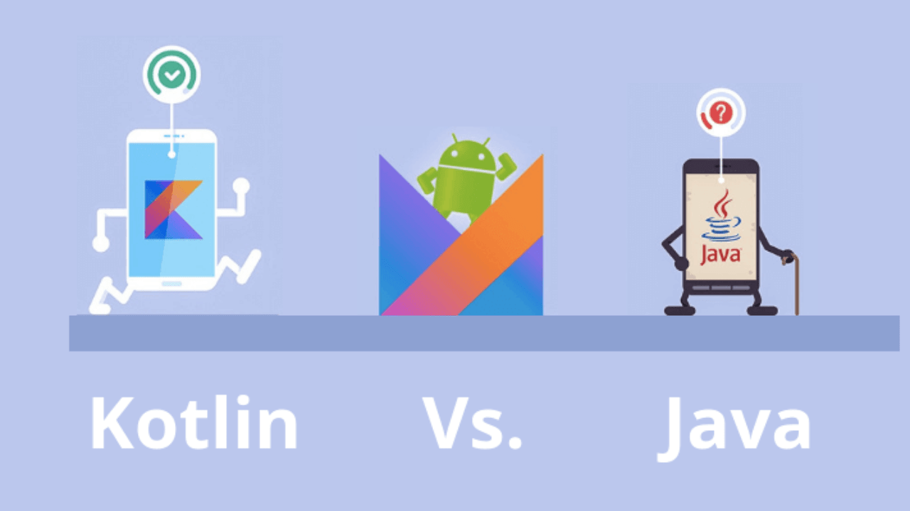

# 🌟 What's Kotlin?  

Kotlin was created by **JetBrains**, a Czech software company famous for its development tools like **IntelliJ IDEA**. The idea for Kotlin started in **2010**, with the goal of addressing the limitations of Java, especially for large-scale software development.

At the time, Java was widely used but had issues such as verbosity, outdated syntax, and the infamous `NullPointerException` (known as the "💸 billion-dollar mistake"). JetBrains wanted a language that could:  
- 📝 **Be more concise**: Allow developers to write less boilerplate code.  
- 🛡️ **Be safer**: Avoid common pitfalls like null-related crashes.  
- 🔄 **Be fully interoperable with Java**: Work seamlessly with existing Java code and libraries.  

By **2011**, JetBrains publicly announced Kotlin, named after **Kotlin Island** in Russia (similar to how Java is named after an island). The language was developed as an open-source project and gained significant traction due to its practical improvements.

---

## ✨ **Key Milestones**:
- 🕰️ **2012**: Kotlin's first public release.  
- 🚀 **2016**: Version 1.0 was released, signaling Kotlin’s first stable version.  
- 📱 **2017**: Google announced official support for Kotlin in Android development at Google I/O.  
- ⭐ **2019**: Google made Kotlin the **preferred language** for Android app development.  
- 🌍 **2021**: Kotlin gained popularity not only for Android but also for server-side, web, and even multi-platform development.  

Today, Kotlin is a powerful, modern language that is praised for its simplicity, safety, and versatility, becoming the go-to language for Android developers worldwide.

---

# 🤔 **Why Kotlin?**  
Kotlin was designed to address many of Java’s limitations while maintaining full compatibility. Let’s break down the key reasons why Kotlin has become the preferred language for Android development—and beyond.

  

---

## 🚀 **1. Concise and Readable Code**  
- Kotlin allows you to write more with fewer lines of code, making your code more readable and maintainable.
- In Kotlin, data class automatically generates useful methods such as `toString()`, `equals()`, and `copy()`.

**Java (Verbose Example):**  
```java
public class User {
    private String name;

    public User(String name) {
        this.name = name;
    }

    public String getName() {
        return name;
    }
    @Override
    public String toString() {
        return "User{" + "name='" + name + '\'' + '}';
    }
}
```
**Kotlin (Concise Example):**
```kotlin
data class User(val name: String)
```

## 🔒 2. **Null Safety (Goodbye NullPointerException)**
In Java, null references are one of the most common sources of bugs. Kotlin eliminates this problem by making null safety part of the type system.
```kotlin
var name: String? = null  // The '?' makes the variable nullable.
println(name?.length)  // Safe call operator prevents crashes.
```
🛡️ With Kotlin, null crashes become a thing of the past!

## 🧠 3. **Smart cast**
Kotlin can automatically detect and cast types without requiring explicit type checks.

**Java**
```java
if (object instanceof String) {
    String str = (String) object;  // Manual casting
    System.out.println(str.length);
}
```
**Kotlin**
```kotlin
if (object is String) {
    println(object.length)  // Smart cast to String automatically
}
```

## 🛠️ 4. **Extension functions**
Kotlin allows you to add new functions to existing classes without modifying their source code.
```kotlin
fun String.addEmoji(): String {
    return this + " 😄"
}

val message = "Hello".addEmoji()  // Output: "Hello 😄"
```

## ⏱️ 5. **Coroutines for Asynchronous Programming**
Kotlin provides coroutines to handle asynchronous tasks in a simple and non-blocking way.

**Java**
```java
doSomethingAsync(new Callback() {
    @Override
    public void onSuccess(Result result) {
        handleResult(result);
    }
});
```
**Kotlin**
```kotlin
GlobalScope.launch {
    val result = doSomethingAsync()
    handleResult(result)
}
```

## 🔄 6. **Interoperability with Java**
Kotlin is 100% interoperable with Java, meaning you can call Java code in Kotlin and vice versa. You don’t need to rewrite entire projects—you can migrate to Kotlin gradually.

## 🧑‍💻 7. **Improved Functional Programming Support**
Kotlin has built-in support for higher-order functions, lambda expressions, and other functional programming features. 
```kotlin
val numbers = listOf(1, 2, 3, 4, 5)
val squares = numbers.map { it * it }  // [1, 4, 9, 16, 25]
```